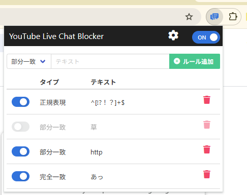

# YouTube Live Chat Blocker

An easy-to-use Google Chrome extension that hides unwanted messages containing specific words in YouTube Live and archived video chats.

## ✨ Features

- **3 Filtering Conditions**:
  - **Contains (Partial match)**: Hides messages if they contain the specified word.
  - **Equals (Exact match)**: Hides messages if they exactly match the specified word.
  - **Regular expression**: Hides messages that match a custom regex pattern.
- **Toggle Controls**:
  - Quickly turn the entire blocker ON or OFF using the main global switch.
  - Temporarily disable or enable individual rules without deleting them.
- **Import / Export Rules**: Easily back up your filtering rules or transfer them to another device as a JSON file via the Options page.
- **Multi-language Support (i18n)**: The interface automatically supports English and Japanese based on your browser settings.

## 📸 Screenshots

## 🚀 How to Use

1. Click the extension icon in your browser toolbar to open the popup window.
2. Select the rule type (Contains, Equals, or Regular expression).
3. Enter the text or pattern you want to block and click **Add Rule**.
4. Matching chat messages will instantly be hidden from YouTube Live!
5. Use the toggles to pause specific rules, or the main switch to pause the entire extension.
6. Access the **Options page** (via the gear icon) to import or export your rule list.

## 📄 License

This project is open-source and licensed under the MIT License.
