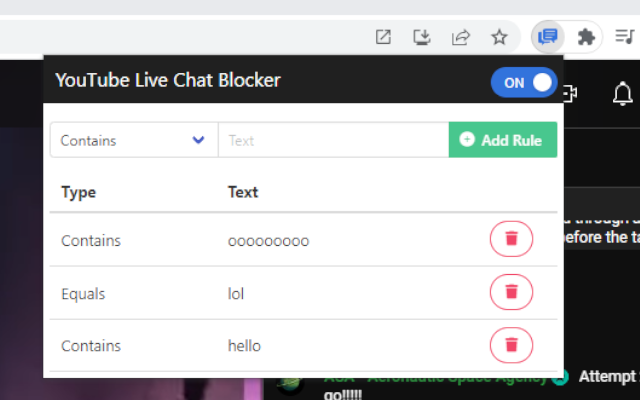

# YouTube Live Chat Blocker

An easy-to-use Google Chrome extension that hides unwanted words in YouTube Live and archived video chats.

## Features

Filtering conditions:

- Partial match: Hides messages if a part of the text matches a specified word.
- Exact match: Hides messages if the text exactly matches a specified word.
- Regular expression: Hides messages that match a specified pattern.

## Screenshot

